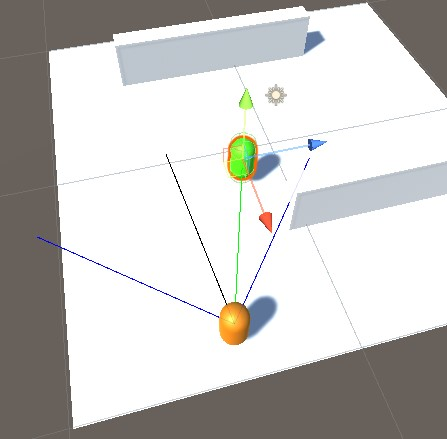
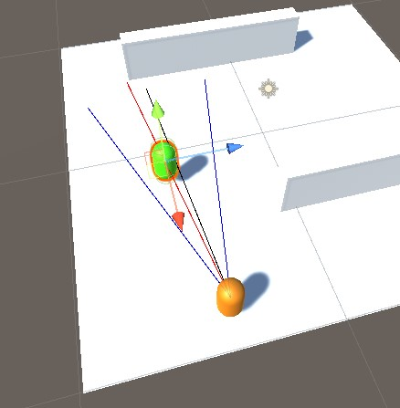
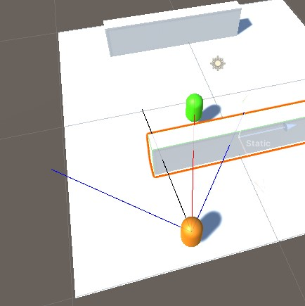
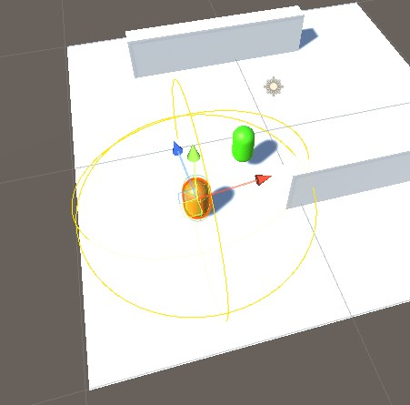

# Hide-and-Seek Behavior Tree
This is a Behavior Tree for a Hide-And-Seek game as part of fulfillment for an Artificial Intelligence course.
The Behavior Tree was created using the asset provided by the [KiwiCoder](https://www.youtube.com/c/TheKiwiCoder) but custom nodes were self-implemented.

One feature that is implemented for the Seeker is vision.

There are two types of vision.
Short vision which has a wider field of view, shorter distance, and detects instantaneously.

Long vision which has a smaller field of view, longer distance, and the detection is delayed simulating how humans need a 
short amount of time to process when seeing objects at a range.

Both of these visions do not work when obscured by an obstacle.

Additionally, the Seeker agent has a small radius in which the agent can detect noise generated by the Hider.

# Sample Runs
Below are a few sample runs of the behavior tree in action.

Run 1

https://user-images.githubusercontent.com/56323639/165448523-1d642cee-0e8c-451f-94df-6abd78e9a6c7.mp4

Run 2

https://user-images.githubusercontent.com/56323639/165448553-40a27645-049c-4db1-bd51-2b3ab6bd1067.mp4

# Results
Below are results of running the hide-and-seek game for a small map compared to a large map in terms of complexity.

